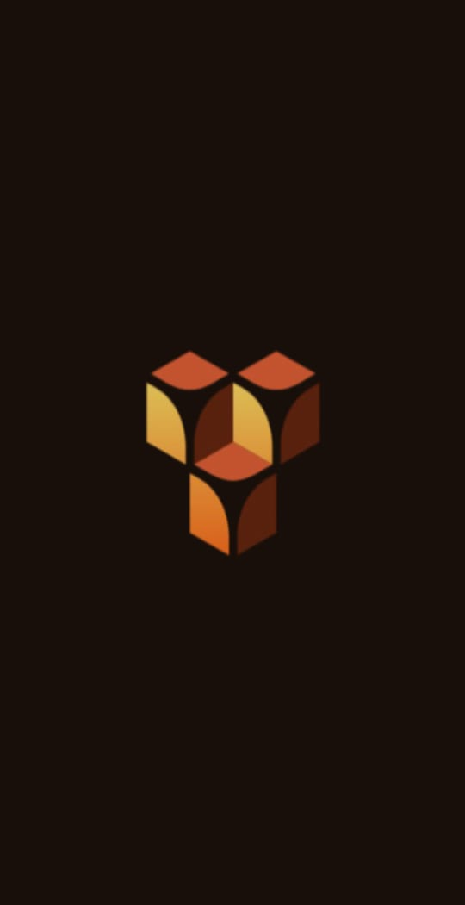
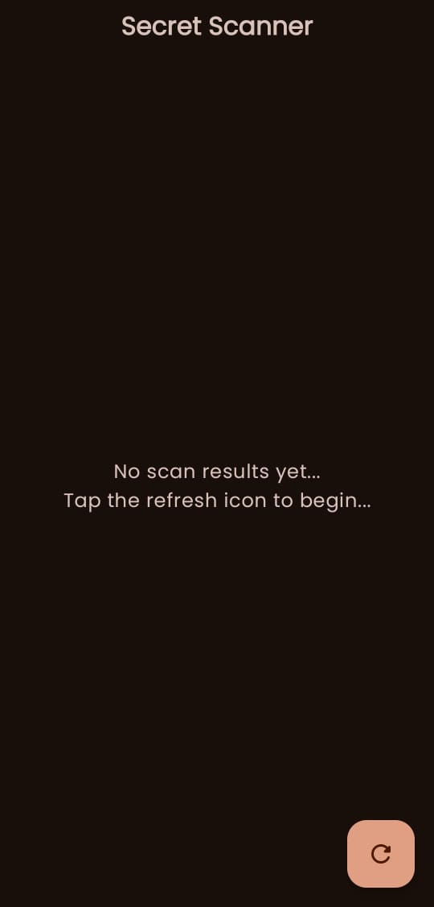
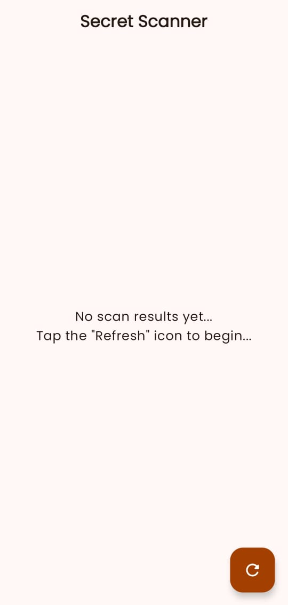
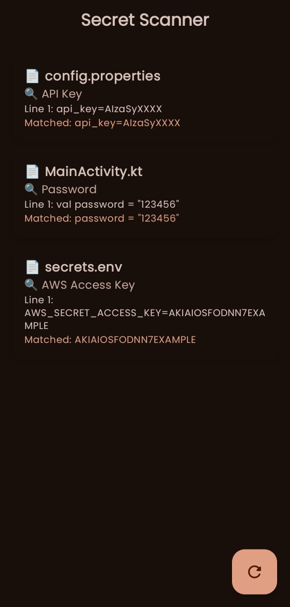
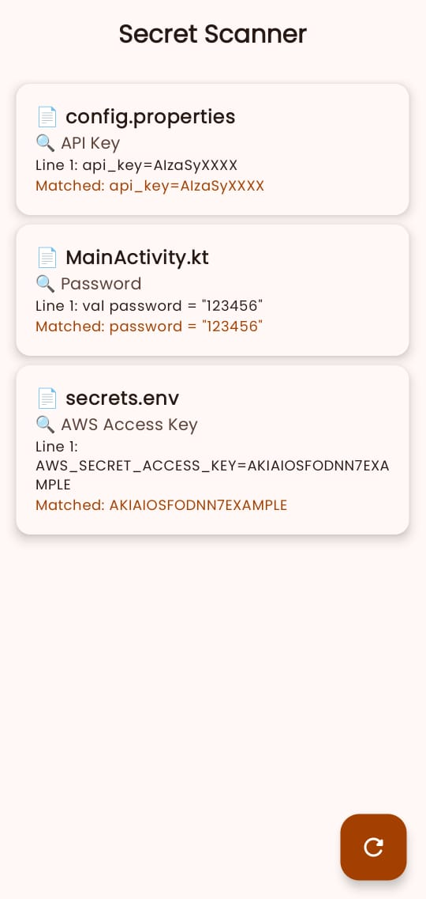
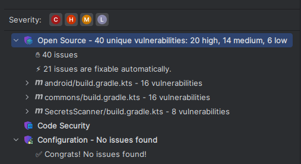

# Secrets Scanner

## Overview

Secrets Scanner is a dummy Kotlin Multiplatform [KMP] Mobile App that scans for Secrets, kinda like Gitleaks......

## Table of Contents

1. [Background](#1-Background)
2. [Architecture](#2-Architecture)
3. [Screenshots](#3-Screenshots)
4. [Testing](#4-Testing)
5. [Challenges & Solutions](#5-Challenges-and-Solutions)
6. [Credits](#6-Credits)
7. [How To Build](#7-How-To-Build)

## 1] Background

This project was built as a learning tool for the [Software Development Lifecycle [SDLC]](https://tryhackme.com/room/sdlc) module in [TryHackMe](http://tryhackme.com/)...

## 2] Architecture

- The project is a [Kotlin Multiplatform[KMP]](https://kotlinlang.org/docs/multiplatform.html) project that comprises of the following modules:

### a] :android

- This module contains the Android-specific functionalities and components, such as MainActivity...

### b] :commons

- This module contains the shared functionalities that are used across multiple Source Sets [:androidMain, :commonMain, :iosMain, and :nativeMain]...

### c] :ios

- This module contains the iOS-specific functionalities and components...

## 3] Screenshots

  <table style="border-collapse: collapse; margin: 0 auto;">
    <thead>
      <tr>
        <th style="padding: 12px;"></th>
        <th style="padding: 12px;">🌙 Dark Mode</th>
        <th style="padding: 12px;">🌞 Light Mode</th>
      </tr>
    </thead>

    <tbody>
      <tr>
        <td style="font-weight: bold; padding: 12px; text-align: left;">Splash Screen</td>
        <td>
          
        </td>
        <td>
          
        </td>
      </tr>

      <tr>
        <td style="font-weight: bold; padding: 12px; text-align: left;">Secrets Scan (Pre-Scan)</td>
        <td>
          
        </td>
        <td>
          
        </td>
      </tr>

      <tr>
        <td style="font-weight: bold; padding: 12px; text-align: left;">Secrets Scan (Post-Scan)</td>
        <td>
          
        </td>
        <td>
          
        </td>
      </tr>
    </tbody>
  </table>

## 4] Testing

| Test                                                        | Description                       |
|-------------------------------------------------------------|-----------------------------------|
|  | This is The Snyk Security Test... |

## 5] Challenges and Solutions

While the project highlights modern practices in Secure UI Design, SDLC-aligned Architecture, and Secrets Detection Simulation, several development challenges emerged:

---

### a] Visualizing The Scan Process Across Two States [Pre and Post]

**Challenge:**
The Mobile App was meant to simulate a "Scan" process — one screen showing a `Pre-Scan` state, and another screen reflecting the `Post-Scan` result, while maintaining visual consistency and clear feedback cues...

**Solution:**
The Screens were designed with Jetpack Compose using a `Sealed Class` to represent UI States: `Success` and `Error`. Transitions between them were animated using `AnimatedVisibility` and `delay()` to simulate the scan. For a better User Experience [UX], relevant Icons, Status Text, and Background Colour were used to reflect changes between UI States...

---

### b] Designing for Light Mode and Dark Mode

**Challenge:**
Ensuring that both Light Mode and Dark Mode versions of the Mobile App remained visually coherent, with readable content and consistent Design Patterns, was difficult. Colors that worked in Light Mode did not always provide good contrast in Dark Mode, and vice versa...

**Solution:**
Two themes were created and leveraged Material 3’s Dynamic Theming. Icons and Text Colours were adjusted using Conditional Styling based on the current System Theme, improving overall Readability and Visual Clarity in both modes...

---

### c] Embedding Screenshots for Dual-Theme Documentation

**Challenge:**
Both Light Mode and Dark Mode screenshots were to be presented for each Screen [Splash, Pre-Scan, and Post-Scan] in a clean and understandable layout for Documentation purposes...

**Solution:**
A two-column, three-row HTML Table was built with aligned Titles and embedded Screenshots using `` Tags and Inline Styling. This showcased both User Interface [UI] Themes side by side, aiding Project Presentation and enhancing Documentation Clarity for viewers reading through the GitHub README...

---

## 6] Credits

- The project has been built using the following Tools, Technologies, and Libraries:

a] [Jetpack Compose](https://developer.android.com/jetpack/compose)

- Google's modern UI toolkit [Jetpack Compose] has been used to design a declarative, reactive, and Kotlin-first User Interface [UI] for Mobile Applications...

b] [Material3](https://developer.android.com/jetpack/compose/designsystems/material3)

- The app adheres to modern Design principles by implementing [Material3], offering customisable components and smooth theming support...

c] [Voyager Navigation](https://github.com/adrielcafe/voyager)

- Voyager is a Navigation library for Kotlin Multiplatform that simplifies screen-based navigation while ensuring Lifecycle Safety and integration with Dependency Injection...

d] [Koin](https://insert-koin.io/)

- For Dependency Injection, the project uses [Koin]—a pragmatic Kotlin-native library that powers both ViewModels and Composables with Lifecycle-aware scoped Injection...

e] [Kotlin Coroutines](https://kotlinlang.org/docs/coroutines-overview.html)

- The project leverages Kotlin Coroutines to handle background tasks such as Network Calls, Room Queries, and Suspending Functions elegantly...

f] [Android SplashScreen API](https://developer.android.com/develop/ui/views/launch/splash-screen)

- A modern SplashScreen API implementation is used to display a consistent launch experience that blends seamlessly into the app's theme...

g] [Google Fonts for Compose](https://developer.android.com/jetpack/compose/text/fonts)

- Google Fonts integration enables custom Typography using Jetpack Compose's Typography styles with support for scalable and legible fonts...

h] [Timber](https://github.com/JakeWharton/timber)

- Timber is utilised as a lightweight, extensible Logging library for Debugging and Diagnostic Logging across the codebase...

i] [Detekt](https://detekt.dev/)

- Detekt is configured to statically analyse Kotlin code and enforce clean code practices for Maintainability and Scalability...

j] [Ktlint](https://github.com/pinterest/ktlint)

- Ktlint enforces Kotlin code style based on official guidelines and integrates into the build process to maintain consistency...

k] [Spotless](https://github.com/diffplug/spotless)

- Spotless ensures source Code Formatting and Linting are applied before commits, further automating Code Quality...

l] [SonarQube for IDE](https://plugins.jetbrains.com/plugin/7973-sonarqube-for-ide)

- The SonarQube for IDE Plugin has been integrated to provide real-time Static Code Analysis, enabling early detection of Code Smells and Technical Debt...

m] [Snyk](https://plugins.jetbrains.com/plugin/10804-snyk-security)

- The Snyk Plugin has been added to identify and remediate Security Vulnerabilities in Third-Party dependencies during Development...

## 7] How To Build

1] To build the project, ensure you have the following requirements:

- [Android Studio](https://developer.android.com/studio)...
- Android Device or Emulator...
- The Libraries and Plugins listed above...

2] Next, clone this GitHub Repository into your local machine using Android Studio by navigating to "New > Project from Version Control"...

3] Copy and Paste the URL of this GitHub Repository and click "Clone"...

4] Let the project build using Gradle...

5] Once done, connect your Android Device to Android Studio by navigating to "Device Manager". You can also create an Emulator instead of using a physical Android Device...

6] Run the app by clicking "Run 'app'"...